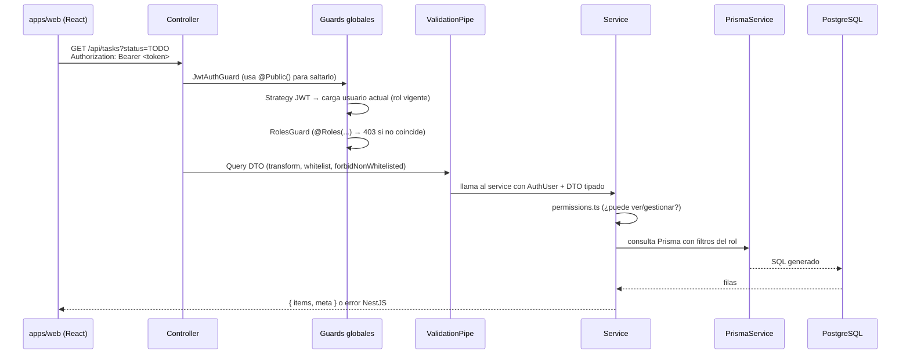
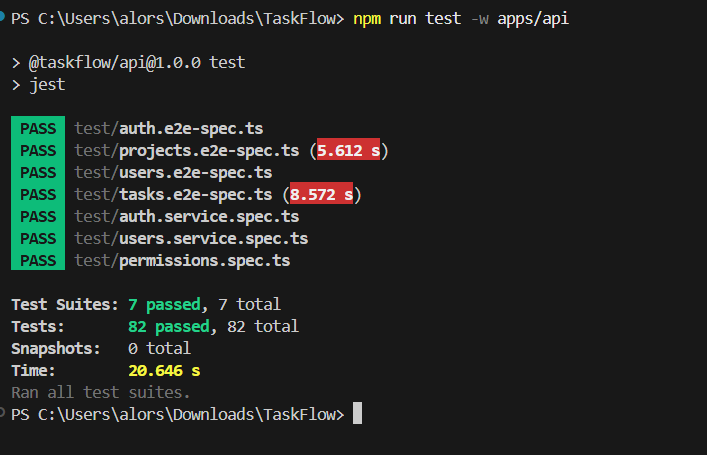
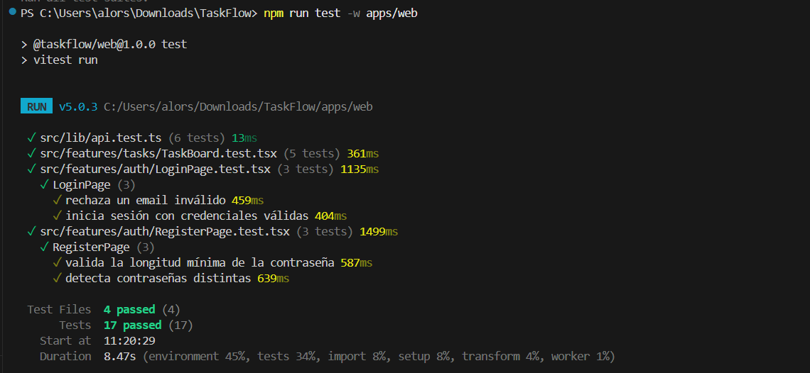
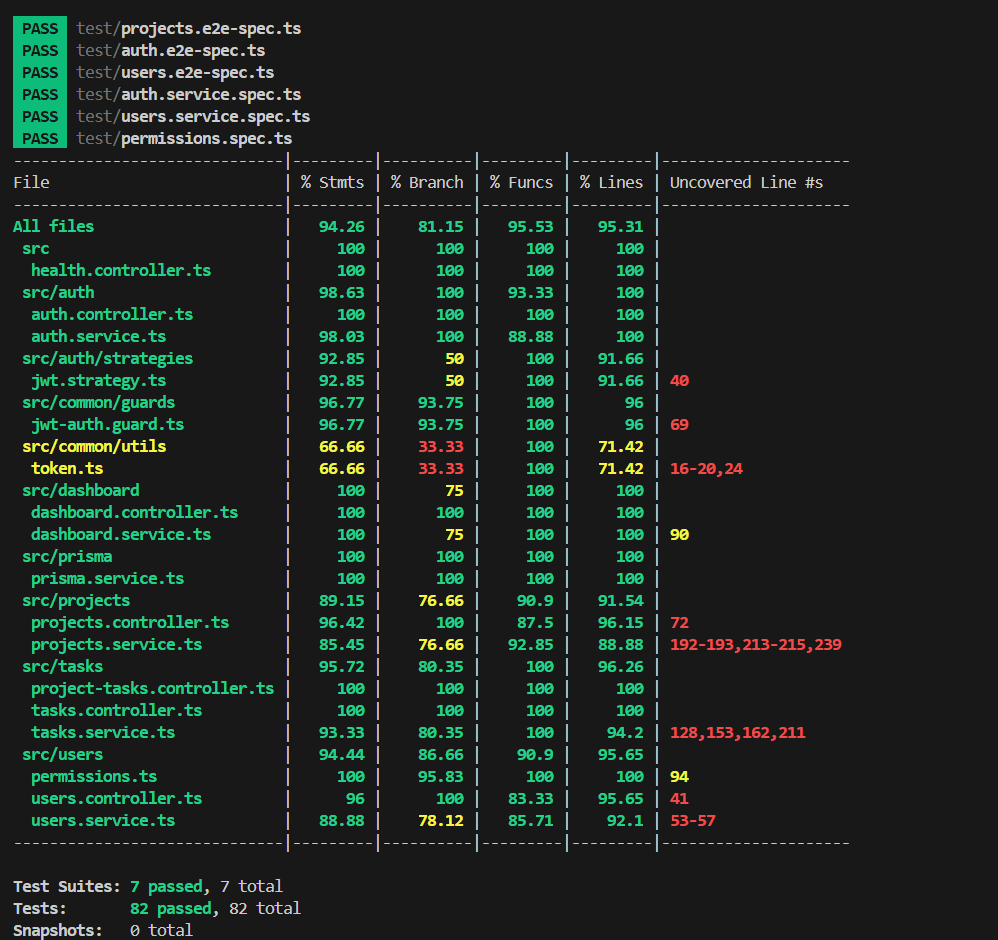

# TaskFlow — Guía de desarrollador 👨‍🔧

Todo lo necesario para entender, modificar, probar e implantar TaskFlow.
Para usar la aplicación consulta [`USUARIO.md`](USUARIO.md); para el contrato REST, [`API.md`](API.md).

---

## Índice

1. [Puesta en entorno](#1-puesta-en-entorno)
2. [Monorepo y arquitectura](#2-monorepo-y-arquitectura)
3. [Flujo de una petición](#3-flujo-de-una-petición)
4. [Convenciones de código](#4-convenciones-de-código)
5. [Cómo añadir un recurso nuevo](#5-cómo-añadir-un-recurso-nuevo)
6. [Permisos y autorización](#6-permisos-y-autorización)
7. [Base de datos con Prisma](#7-base-de-datos-con-prisma)
8. [Pruebas](#8-pruebas)
9. [Calidad de código: ESLint y Prettier](#9-calidad-de-código-eslint-y-prettier)
10. [Integración continua y despliegue](#10-integración-continua-y-despliegue)
11. [Decisiones técnicas](#11-decisiones-técnicas)
12. [Checklist de pull request](#12-checklist-de-pull-request)
13. [Problemas frecuentes de desarrollo](#13-problemas-frecuentes-de-desarrollo)

---

## 1. Puesta en entorno

```bash
npm install          # instala todos los workspaces
cp .env.example .env # configuración local
docker compose up -d db   # solo PostgreSQL (o usa tu instalación local 16)
npm run db:migrate        # aplica las migraciones
npm run db:seed           # datos de demostración (opcional)
npm run dev               # API :4000 + Web :5173
```

Verifica el entorno con:

```bash
npm run lint        # ESLint en apps/api y apps/web
npm test            # toda la suite
npm run build       # compila ambos proyectos
```

| Servicio   | URL                            | Comando                   |
| ---------- | ------------------------------ | ------------------------- |
| API        | http://localhost:4000/api      | `npm run dev -w apps/api` |
| Swagger    | http://localhost:4000/api/docs | incluido en la API        |
| Web        | http://localhost:5173          | `npm run dev -w apps/web` |
| PostgreSQL | `localhost:5432`               | `docker compose up -d db` |

---

## 2. Monorepo y arquitectura

```text
TaskFlow/
├── package.json            # workspaces: apps/*
├── tsconfig.base.json      # opciones TS compartidas
├── docker-compose.yml      # db + api + web
├── .github/workflows/ci.yml
├── docs/                   # documentación (este directorio)
└── apps/
    ├── api/                # NestJS + Prisma
    │   ├── prisma/         # schema · migrations · seed
    │   ├── src/            # código de producción
    │   └── test/           # TODO el test (unit + integración)
    └── web/                # React + Vite
```

- **npm workspaces**: un solo `package-lock.json`, dependencias _hoisted_ en la raíz y scripts
  por workspace (`npm run <script> -w apps/api`).
- Cada `app` es autónoma: tiene su propio `tsconfig`, `eslint.config`, scripts y Dockerfile.
- La raíz solo aporta scripts agregados, Prettier y formato.

### Backend: módulos

| Módulo       | Responsabilidad                                                                           |
| ------------ | ----------------------------------------------------------------------------------------- |
| `auth/`      | Registro, login, rotación de _refresh tokens_, estrategia JWT                             |
| `users/`     | CRUD de usuarios, roles y **`permissions.ts`** (reglas puras)                             |
| `projects/`  | Proyectos y miembros                                                                      |
| `tasks/`     | Tareas, estados y comentarios (`ProjectTasksController` anida `POST /projects/:id/tasks`) |
| `dashboard/` | Agregaciones del panel                                                                    |
| `prisma/`    | `PrismaService` **global** (inyectable en cualquier módulo)                               |
| `common/`    | Guards, decoradores (`@Public`, `@Roles`, `@CurrentUser`), DTOs compartidos               |

### Frontend: `features/`

Cada funcionalidad vive en su carpeta con sus páginas, componentes y tests; `lib/api.ts` concentra
el cliente HTTP y `store/auth-store.ts` la sesión (Zustand + persist).

---

## 3. Flujo de una petición



Puntos clave:

- **Los guards son globales** (registrados con `APP_GUARD` en `app.module.ts`), en este orden:
  `JwtAuthGuard` → `RolesGuard`.
- La **autorización por recurso** (¿este usuario toca este proyecto/tarea?) se resuelve en el
  _service_, nunca en el cliente.
- `ValidationPipe({ whitelist: true, forbidNonWhitelisted: true, transform: true })` elimina y
  rechaza propiedades no declaradas: **añadir un campo a un body implica declararlo en el DTO**.

---

## 4. Convenciones de código

| Área       | Regla                                                                                                                                                                      |
| ---------- | -------------------------------------------------------------------------------------------------------------------------------------------------------------------------- |
| Idioma     | UI, comentarios de usuario y mensajes de error en **español**; identificadores en inglés                                                                                   |
| Nombres    | `camelCase` variables/métodos, `PascalCase` clases y componentes, `SCREAMING_SNAKE` constantes                                                                             |
| Módulo     | `x.module.ts` · `x.controller.ts` · `x.service.ts` · `dto/x.dto.ts`                                                                                                        |
| DTOs       | Clases con `class-validator` + `@ApiProperty` de Swagger; herencia con `PartialType`/`OmitType` de `@nestjs/swagger`                                                       |
| Tipos      | `strict: true`, sin `any` innecesarios, `import type` para tipos                                                                                                           |
| Errores    | Usar las excepciones de Nest: `BadRequestException` (400), `UnauthorizedException` (401), `ForbiddenException` (403), `NotFoundException` (404), `ConflictException` (409) |
| Respuestas | Listados → `{ items, meta }` (`paginate()` de `common/dto/pagination.dto.ts`)                                                                                              |
| IDs        | Siempre `uuid` (`ParseUUIDPipe` en los parámetros de ruta)                                                                                                                 |
| `console`  | Solo en `main.ts`, `prisma/seed.ts` y tests (regla `no-console`)                                                                                                           |

Ejemplo mínimo de endpoint:

```ts
@Get(':id')
@ApiOperation({ summary: 'Detalle de una tarea' })
findOne(
  @CurrentUser() user: AuthUser,
  @Param('id', ParseUUIDPipe) id: string,
): Promise<TaskSummary> {
  return this.tasksService.findOne(user, id);
}
```

---

## 5. Cómo añadir un recurso nuevo

1. **Esquema** → edita `apps/api/prisma/schema.prisma` y crea la migración:
   ```bash
   npm run db:migrate -w apps/api -- --name add_report
   ```
2. **DTO** → `src/<modulo>/dto/create-x.dto.ts` con validadores y `@ApiProperty`.
3. **Service** → lógica de negocio + consultas Prisma; **aplica `permissions.ts`**.
4. **Controller** → rutas, `@Roles(...)` si el acceso es restringido, `@Public()` solo si es
   realmente anónimo.
5. **Módulo** → registra controller y service (`exports` si otros módulos lo usan).
6. **Swagger** → `@ApiTags`, `@ApiOperation`, `@ApiBearerAuth('bearer')`.
7. **Tests** → añade `test/<recurso>.e2e-spec.ts` (y unitario si hay lógica relevante).
8. **Contrato** → actualiza `docs/API.md` y, si procede, el frontend.
9. **Verificación** → `npm run lint && npm test && npm run build`.

---

## 6. Permisos y autorización

### Capas

| Capa          | Archivo                           | Qué hace                                                                                                                                                       |
| ------------- | --------------------------------- | -------------------------------------------------------------------------------------------------------------------------------------------------------------- |
| Autenticación | `common/guards/jwt-auth.guard.ts` | Valida el JWT; `@Public()` lo omite                                                                                                                            |
| Rol           | `RolesGuard` (mismo fichero)      | Comprueba `@Roles(Role.X)` → 403                                                                                                                               |
| Recurso       | `src/users/permissions.ts`        | Funciones **puras**: `canViewProject`, `canManageProject`, `canEditTask`, `canChangeTaskStatus`, `canComment`, `projectVisibilityWhere`, `taskVisibilityWhere` |
| Visibilidad   | `*VisibilityWhere()`              | Devuelven filtros Prisma por rol (ADMIN ve todo, MEMBER solo lo suyo)                                                                                          |

### Reglas vigentes

```ts
canViewProject   → ADMIN | propietario | miembro
canManageProject → ADMIN | (MANAGER && propietario)
canEditTask      → canManageProject | (MEMBER && asignada && miembro)
canComment       → canViewProject
```

Cualquier cambio de reglas **debe**:

1. Modificarse en `permissions.ts` (no en el _service_),
2. Acompañarse de tests unitarios en `test/permissions.spec.ts`,
3. Reflejarse en las tablas de `README.md`, `docs/USUARIO.md` y `docs/API.md`.

### Tokens

| Token        | Duración                   | Almacenamiento                      | Renovación                                |
| ------------ | -------------------------- | ----------------------------------- | ----------------------------------------- |
| Access (JWT) | `JWT_ACCESS_TTL` (15 min)  | Memoria/localStorage del navegador  | Petición `POST /auth/refresh`             |
| Refresh      | `JWT_REFRESH_TTL` (7 días) | **SHA-256** en tabla `RefreshToken` | Rotación en cada uso; borrado en `logout` |

La _strategy_ consulta la base de datos en cada petición: un cambio de rol se aplica **sin**
volver a iniciar sesión.

---

## 7. Base de datos con Prisma

| Tarea                           | Comando                                     |
| ------------------------------- | ------------------------------------------- |
| Generar cliente                 | `npm run prisma:generate -w apps/api`       |
| Migración (desarrollo)          | `npm run db:migrate`                        |
| Migraciones (producción/CI)     | `npm run prisma:migrate:deploy -w apps/api` |
| Reset completo (⚠️ borra datos) | `npm run db:reset`                          |
| Datos de demo                   | `npm run db:seed`                           |
| Explorador gráfico              | `npm run prisma:studio -w apps/api`         |

**Reglas:**

- Nunca edites migraciones ya aplicadas; crea una nueva.
- Revisa el SQL generado en `prisma/migrations/<timestamp>_<nombre>/migration.sql`.
- Los `enum`s del esquema (`Role`, `TaskStatus`…) se importan como tipos en TypeScript:
  `import { Role } from '@prisma/client'`.
- El _seed_ usa `upsert` → se puede ejecutar varias veces sin duplicar.

---

## 8. Pruebas

> **Todos los tests de la API están en `apps/api/test/`.**

### Organización

```text
apps/api/test/
├── setup/
│   ├── env.ts            # carga .env y fija DATABASE_URL = test
│   ├── global-setup.ts   # prisma migrate deploy + TRUNCATE (una vez)
│   ├── after-env.ts      # TRUNCATE antes de cada fichero
│   └── db.ts             # dbSuite() → describe normal u omitido
├── utils.ts              # helpers: register(), login(), bearer(), createSessionWithRole()
├── permissions.spec.ts       # unitario: reglas de permisos
├── auth.service.spec.ts      # unitario: servicios con Prisma simulado
├── users.service.spec.ts     # unitario: últimas reglas de ADMIN
├── auth.e2e-spec.ts          # integración: registro/login/refresh/logout
├── projects.e2e-spec.ts      # integración: visibilidad y miembros
├── tasks.e2e-spec.ts         # integración: tareas, estados, comentarios, dashboard
└── users.e2e-spec.ts         # integración: roles y usuarios
```

### Niveles

| Nivel            | Herramienta      | Comando                    | No necesita BD |
| ---------------- | ---------------- | -------------------------- | -------------- |
| Unitario         | Jest + mocks     | `npm run test -w apps/api` | ❌*            |
| Integración      | Jest + Supertest | igual                      | ❌*            |
| Componente (web) | Vitest + RTL     | `npm run test -w apps/web` | ✅             |

\* Si PostgreSQL no responde, `global-setup` avisa y los tests de integración se **omiten**
(`dbSuite()`), dejando pasar los unitarios.

### Detalles de implementación

- **Base de datos separada**: `TEST_DATABASE_URL` (`taskflow_test`). Los tests **nunca** tocan la
  base de desarrollo: `test/setup/env.ts` sobrescribe `DATABASE_URL`.
- **Aislamiento**: `maxWorkers: 1` + `TRUNCATE … RESTART IDENTITY CASCADE` antes de cada fichero.
- **App real**: los _e2e_ montan `AppModule` completo con `Test.createTestingModule` y repiten el
  `ValidationPipe` y el prefijo `/api` de `main.ts`.
- **Sin red**: los tests del frontend mockean `fetch`.
- **Cobertura**: `npm run test:cov -w apps/api` con umbrales en
  `src/auth/**` y `src/users/permissions.ts` (≥ 70 %).

### Escribiendo un test de integración

```ts
import { dbSuite } from './setup/db';
import { bearer, createSessionWithRole } from './utils';

const describeWithDb = dbSuite();

describeWithDb('Proyectos · integración', () => {
  // beforeAll: Test.createTestingModule({ imports: [AppModule] }) → app.init()
  //           prisma.cleanDatabase() y creación de usuarios con rol concreto

  it('MEMBER no puede crear proyectos (403)', async () => {
    await request(app.getHttpServer())
      .post('/api/projects')
      .set(bearer(member.accessToken))
      .send({ name: 'Prohibido' })
      .expect(403);
  });
});
```

### Resultados de la suite ✅

Ejecución real (2026-10-01) sobre PostgreSQL 16 local:

**Tests de la API** — `npm run test -w apps/api`

```text
PASS  test/auth.e2e-spec.ts
PASS  test/projects.e2e-spec.ts
PASS  test/users.e2e-spec.ts
PASS  test/tasks.e2e-spec.ts
PASS  test/auth.service.spec.ts
PASS  test/users.service.spec.ts
PASS  test/permissions.spec.ts

Test Suites: 7 passed, 7 total
Tests:       82 passed, 82 total
Snapshots:   0 total
Time:        20.646 s
```



**Tests del frontend** — `npm run test -w apps/web`

```text
✓ src/lib/api.test.ts (6 tests)                     13ms
✓ src/features/tasks/TaskBoard.test.tsx (5 tests)  361ms
✓ src/features/auth/LoginPage.test.tsx (3 tests)  1135ms
✓ src/features/auth/RegisterPage.test.tsx (3 tests) 1499ms

Test Files  4 passed (4)
     Tests  17 passed (17)
  Duration  8.47s
```



**Cobertura** — `npm run test:cov -w apps/api` (sale con `exit 0`: supera los umbrales)

```text
File                          | % Stmts | % Branch | % Funcs | % Lines
------------------------------|---------|----------|---------|--------
All files                     |   94.26 |    81.15 |   95.53 |   95.31
 src/auth                     |   98.63 |   100.00 |   93.33 |  100.00
   auth.controller.ts         |     100 |      100 |     100 |     100
   auth.service.ts            |   98.03 |      100 |   88.88 |     100
 src/users/permissions.ts     |     100 |    95.83 |     100 |     100
 src/tasks                    |   95.72 |    80.35 |     100 |   96.26
 src/dashboard                |     100 |    75.00 |     100 |     100
```



> Umbrales exigidos: `src/auth` ≥ 70 % (statements/branches/functions/lines) y
> `src/users/permissions.ts` ≥ 90 % — ambos holgadamente superados.
> ⚠️ Detalle: los umbrales se declaran **por directorio/ruta** (`'src/auth'`), no con globs,
> porque Jest evalía los globs **fichero a fichero**.

---

## 9. Calidad de código: ESLint y Prettier

```bash
npm run lint            # ambos apps
npm run format          # escribe con Prettier
npm run format:check    # solo comprueba (CI)
```

- Configuración **flat config**: `eslint.config.js` en cada `app`.
- Reglas destacadas: `no-unused-vars` (error), `no-console` (solo `warn`/`error`),
  `typescript-eslint` recommended + `eslint-config-prettier`.
- ⚠️ **`consistent-type-imports` está DESACTIVADO a propósito en `apps/api`**: convertir los
  imports de clases inyectadas (`PrismaService`, `Reflector`, DTOs usados en `@Body`/`@Query`)
  en `import type` rompe `emitDecoratorMetadata` → Nest recibe `Function` como dependencia y
  la validación rechaza todos los campos (_«property X should not exist»_). Regla práctica:
  **las clases se importan como valor; las interfaces pueden ir como `import type`.**
  En `apps/web` sí está activa (React no usa metadatos de decoradores).
- Prettier unificado en la raíz: comillas simples, punto y coma, 100 columnas, `LF`.

---

## 10. Integración continua y despliegue

`.github/workflows/ci.yml` (en cada _push_/_PR_ a `main`):

```text
postgres:16-alpine (service)
   └─ npm ci → prisma generate → lint → format:check
        └─ prisma migrate deploy → npm test → npm run build
```

Despliegue con Docker: [`DESPLIEGUE.md`](DESPLIEGUE.md). La API ejecuta
`npx prisma migrate deploy` antes de arrancar; la web se sirve con Nginx.

---

## 11. Decisiones técnicas

| Decisión                                 | Motivo                                                                                                                                                      |
| ---------------------------------------- | ----------------------------------------------------------------------------------------------------------------------------------------------------------- |
| **NestJS 11** (no 12)                    | Nest 12 publica sus paquetes **solo ESM** y `jest`+`ts-jest` (CommonJS) no puede _requerirlos_; 11 es estable, CJS y compatible con `emitDecoratorMetadata` |
| **Prisma 6**                             | Cliente consolidado y compatible con el patrón `prisma-client-js` del proyecto                                                                              |
| **Jest en la API / Vitest en la web**    | Jest integra `emitDecoratorMetadata` (necesario para la DI de Nest); Vitest encaja con Vite y es más rápido en el navegador                                 |
| **Tests en `apps/api/test/`**            | Separa código de producción de pruebas; una sola carpeta fácil de localizar y de excluir del build                                                          |
| **`permissions.ts` puro**                | Las reglas de autorización se prueban sin BD y se reutilizan en todos los módulos                                                                           |
| **Refresh tokens en tabla**              | Permiten revocación real (`logout`) y rotación; el token solo se guarda hasheado (SHA-256)                                                                  |
| **`maxWorkers: 1`**                      | Las suites comparten una BD: ejecución en serie evita carreras de `TRUNCATE`                                                                                |
| **Tailwind 4 sin `tailwind.config`**     | La v4 se configura por CSS (`@import "tailwindcss"` y `@theme`)                                                                                             |
| **TypeScript 5.9**                       | `ts-jest` admite `>=4.3 <7`; TS 6/7 rompería tipos de librerías                                                                                             |
| **Docker Compose como fuente de verdad** | `docker compose up` levanta el sistema completo sin instalaciones manuales                                                                                  |

---

## 12. Checklist de pull request

- [ ] `npm run lint` y `npm run format:check` sin avisos
- [ ] `npm test` en verde (incluye los nuevos casos)
- [ ] `npm run build` compila API y web
- [ ] Nuevas tablas/campos → migración incluida y `docs/API.md` actualizado
- [ ] Cambios de permisos → `permissions.ts` + `permissions.spec.ts` + tablas de la documentación
- [ ] Sin secretos ni `.env` en el _commit_
- [ ] Mensajes de error/interfaz en español

---

## 13. Problemas frecuentes de desarrollo

| Problema                              | Solución                                                          |
| ------------------------------------- | ----------------------------------------------------------------- |
| `Cannot find module '@prisma/client'` | `npm run prisma:generate -w apps/api`                             |
| Tests de integración omitidos         | `docker compose up -d db` y reintenta                             |
| `PrismaClient` desconectado en tests  | El _suite_ usa la app montada (`app.get(PrismaService)`)          |
| Errores `TS6133` en tests             | El _tsconfig_ activa `noUnusedLocals`: elimina o renombra con `_` |
| CORS en dev                           | `CORS_ORIGIN=http://localhost:5173` en `.env`                     |
| Puerto ocupado                        | Cambia `API_PORT` o `server.port` en `vite.config.ts`             |
| Migración local descuadrada           | `npm run db:reset` (solo entornos de desarrollo)                  |
| Swagger no muestra un campo           | Falta `@ApiProperty` en el DTO                                    |
