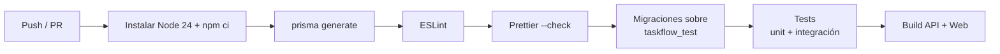

# TaskFlow — Despliegue y operaciones 🚀

Cómo llevar TaskFlow a un entorno de pruebas o de producción, con Docker como vía principal.

---

## Índice

1. [Arquitectura de despliegue](#1-arquitectura-de-despliegue)
2. [Despliegue con Docker Compose](#2-despliegue-con-docker-compose)
3. [Variables de entorno en producción](#3-variables-de-entorno-en-producción)
4. [Las imágenes (multi-stage)](#4-las-imágenes-multi-stage)
5. [Migraciones de base de datos](#5-migraciones-de-base-de-datos)
6. [CI/CD con GitHub Actions](#6-cicd-con-github-actions)
7. [Copias de seguridad y restauración](#7-copias-de-seguridad-y-restauración)
8. [Monitorización y salud](#8-monitorización-y-salud)
9. [Seguridad en producción](#9-seguridad-en-producción)
10. [Checklist de puesta en producción](#10-checklist-de-puesta-en-producción)
11. [Rollback](#11-rollback)

---

## 1. Arquitectura de despliegue

```text
                    ┌─────────────────────────────────────────┐
  usuario ──HTTP──► │  web  (Nginx)  :5173 → 80              │
                    │    · sirve el bundle estático           │
                    │    · /api/* hace proxy a api:4000       │
                    └───────────────────┬─────────────────────┘
                                        │ proxy interno
                    ┌───────────────────▼─────────────────────┐
                    │  api  (NestJS + Prisma)  :4000          │
                    │    · arranca con: prisma migrate deploy │
                    │      && node dist/main.js               │
                    └───────────────────┬─────────────────────┘
                                        │ DATABASE_URL
                    ┌───────────────────▼─────────────────────┐
                    │  db  (PostgreSQL 16)  :5432             │
                    │    · volumen persistente pgdata          │
                    │    · healthcheck pg_isready             │
                    └─────────────────────────────────────────┘
```

Puertos publicados:

| Servicio | Puerto host → contenedor | Exponer en producción                     |
| -------- | ------------------------ | ----------------------------------------- |
| `web`    | `5173 → 80`              | ✅ único punto de entrada (o 443 con TLS) |
| `api`    | `4000 → 4000`            | ⚠️ opcional; idealmente solo interno      |
| `db`     | `5432 → 5432`            | ❌ **nunca** exponer a Internet           |

---

## 2. Despliegue con Docker Compose

### Primer arranque

```bash
git clone https://github.com/alberto2005-coder/taskflow.git TaskFlow && cd TaskFlow

# 1. Configuración
cp .env.example .env
$EDITOR .env          # secrets reales (ver apartado 3)

# 2. Construir y levantar
docker compose up -d --build

# 3. Verificar
docker compose ps
curl http://localhost:4000/api/health     # {"status":"ok",...}
open http://localhost:5173
```

El servicio `api` ejecuta `npx prisma migrate deploy` **antes** de arrancar Node: las migraciones
aplicadas se versionan en `apps/api/prisma/migrations/`.

### Comandos habituales

| Acción                   | Comando                                                            |
| ------------------------ | ------------------------------------------------------------------ |
| Arrancar                 | `docker compose up -d`                                             |
| Reconstruir tras cambios | `docker compose up -d --build`                                     |
| Ver logs                 | `docker compose logs -f api` · `-f web` · `-f db`                  |
| Parar                    | `docker compose down` (los datos persisten en el volumen `pgdata`) |
| Parar y borrar datos     | `docker compose down -v` ⚠️                                        |
| Shell dentro de la API   | `docker compose exec api sh`                                       |
| Consola psql             | `docker compose exec db psql -U postgres -d taskflow`              |

### Solo la base de datos (desarrollo local)

```bash
docker compose up -d db      # luego npm run dev
```

---

## 3. Variables de entorno en producción

Define las siguientes en `.env` (raíz, usada por Compose) o en el orquestador:

| Variable             | Valor recomendado                      | Notas                                      |
| -------------------- | -------------------------------------- | ------------------------------------------ |
| `JWT_ACCESS_SECRET`  | ≥ 64 caracteres aleatorios             | `openssl rand -base64 48`                  |
| `JWT_REFRESH_SECRET` | **distinta** de la anterior            | Rotación de refresh tokens                 |
| `JWT_ACCESS_TTL`     | `15m`                                  |                                            |
| `JWT_REFRESH_TTL`    | `7d`                                   |                                            |
| `CORS_ORIGIN`        | `https://tudominio.com`                | Coma separada si hay varios                |
| `DATABASE_URL`       | lo fija el propio `docker-compose.yml` | `postgresql://postgres:…@db:5432/taskflow` |
| `VITE_API_URL`       | `/api` (build)                         | El Nginx hace de proxy                     |

Generador de secretos:

```bash
# Linux/macOS
openssl rand -base64 48
# PowerShell
-join ((48..1) | ForEach-Object { [char]((Get-Random -Min 65 -Max 122)) })
```

> Compose sustituye `${JWT_ACCESS_SECRET:-valor-por-defecto}`: **no** dejes los valores por
> defecto de `.env.example` en producción.

---

## 4. Las imágenes (multi-stage)

| Dockerfile            | Etapas                                                                                                                      | Resultado                      |
| --------------------- | --------------------------------------------------------------------------------------------------------------------------- | ------------------------------ |
| `apps/api/Dockerfile` | `build` (npm install + `prisma generate` + `nest build`) → `deps` (producción) → `runner` (node:20-alpine, usuario no root) | Imagen con `dist/` y `prisma/` |
| `apps/web/Dockerfile` | `build` (ARG `VITE_API_URL=/api`, `vite build`) → `nginx:alpine` con `nginx.conf`                                           | Estático + proxy `/api`        |

Ambos se construyen con **contexto en la raíz** del repositorio:

```bash
docker build -f apps/api/Dockerfile .
docker build -f apps/web/Dockerfile . --build-arg VITE_API_URL=/api
```

`nginx.conf` sirve `dist/` con `try_files $uri /index.html` (SPA) y reenvía `/api/` a
`http://api:4000/api/`.

---

## 5. Migraciones de base de datos

| Entorno         | Comando                                                                   |
| --------------- | ------------------------------------------------------------------------- |
| Desarrollo      | `npm run db:migrate` → `prisma migrate dev` (crea + aplica + pide nombre) |
| Producción / CI | `npx prisma migrate deploy` (solo aplica las pendientes, nunca modifica)  |

**Buenas prácticas:**

1. Una migración por _pull request_, con nombre descriptivo (`add_task_comments`).
2. Revisar el SQL generado antes de commitearlo.
3. Nunca editar migraciones ya aplicadas: crear una nueva.
4. Cambios incompatibles (renombrar/borrar columna): hacerlo en dos despliegues
   (añadir → migrar datos → eliminar en la siguiente versión).
5. Arranque automático en el contenedor `api` (aparece en `docker-compose.yml`).

---

## 6. CI/CD con GitHub Actions

`.github/workflows/ci.yml` se ejecuta en cada _push_ y _pull request_ a `main`:



| Paso           | Comando                                     | Servicio               |
| -------------- | ------------------------------------------- | ---------------------- |
| Dependencias   | `npm ci`                                    | —                      |
| Cliente Prisma | `npm run prisma:generate -w apps/api`       | —                      |
| Lint           | `npm run lint`                              | —                      |
| Formato        | `npm run format:check`                      | —                      |
| Migraciones    | `npm run prisma:migrate:deploy -w apps/api` | `postgres:16-alpine`   |
| Tests          | `npm test`                                  | idem (`taskflow_test`) |
| Build          | `npm run build`                             | —                      |

El _job_ declara un **service container** `postgres:16-alpine` con `TEST_DATABASE_URL` apuntando
a `taskflow_test`, de modo que los tests de integración corren contra una BD real y efímera.

### Propuesta de despliegue automático

```yaml
# Tras pasar CI en main:
#   1. docker compose build && docker compose push (registro privado)
# 2. En el servidor: git pull && docker compose up -d --build
# 3. prisma migrate deploy se ejecuta automáticamente al arrancar "api"
```

---

## 7. Copias de seguridad y restauración

```bash
# Copia
docker compose exec db pg_dump -U postgres -Fc taskflow > backup_$(date +%Y%m%d).dump

# Restauración
docker compose exec -T db pg_restore -U postgres -d taskflow --clean --if-exists < backup.dump
```

Recomendaciones:

- Copia **diaria** del volumen `pgdata` y de los `.dump`.
- Prueba la restauración en un entorno aparte al menos una vez al trimestre.
- Las copias contienen datos personales: cifra el archivo y limita sus permisos.

---

## 8. Monitorización y salud

| Señal         | Cómo                                                                                    |
| ------------- | --------------------------------------------------------------------------------------- |
| API viva      | `GET /api/health` → `200 {"status":"ok"}` (punto ideal para el _probe_ del orquestador) |
| Logs          | `docker compose logs -f api` (Nest escribe en _stdout_)                                 |
| Base de datos | _healthcheck_ `pg_isready` del propio Compose                                           |
| Recursos      | `docker stats`                                                                          |

Consejo: en el orquestador, reinicia el contenedor `api` si el _healthcheck_ falla 3 veces
seguidas; Prisma reintentará la conexión al reiniciar.

---

## 9. Seguridad en producción

- ✅ **HTTPS** delante de Nginx (Let's Encrypt / Caddy / Cloudflare).
- ✅ Secretos en `.env` **fuera del repositorio** (o en el gestor de secretos).
- ✅ `helmet` activo (cabeceras) y **CORS** restringido a tu dominio.
- ✅ Contraseñas con **bcrypt** (10 rondas); jamás en logs ni en respuestas API.
- ✅ Refresh tokens guardados **hasheados (SHA-256)** y revocados en `logout`.
- ✅ Validación estricta de DTOs (`whitelist` + `forbidNonWhitelisted`).
- ✅ Puerto de PostgreSQL **no publicado** fuera del servidor.
- ⚠️ Recomendable añadir _rate limiting_ en `/auth/login` (pendiente en el roadmap).
- ⚠️ Revisa `npm audit` antes de cada release.

---

## 10. Checklist de puesta en producción

- [ ] `.env` con secretos propios y rotados
- [ ] `CORS_ORIGIN` apunta solo al dominio público
- [ ] `docker compose up -d --build` sin errores
- [ ] `GET /api/health` responde `200`
- [ ] Migraciones aplicadas (`prisma migrate deploy` en los logs)
- [ ] `/api/docs` **deshabilitado o protegido** si no debe ser público
- [ ] Puerto `5432` cerrado al exterior
- [ ] Copia de seguridad automatizada configurada
- [ ] HTTPS activo y renovación automática
- [ ] `npm audit` sin vulnerabilidades críticas
- [ ] Usuario administrador inicial creado (o `npm run db:seed` y cambiar su contraseña)

---

## 11. Rollback

1. **Código**: despliega la _tag_ anterior (`git checkout <tag> && docker compose up -d --build`).
2. **Base de datos**: solo si la migración es compatible hacia atrás
   (`prisma migrate resolve --rolled-back <migration>` + restaurar el _dump_ anterior).
3. Comprueba `/api/health` y las pruebas de humo (login → crear proyecto → crear tarea).

---

Volver a la [documentación general](../README.md) · [Guía de desarrollo](DESARROLLADOR.md).
