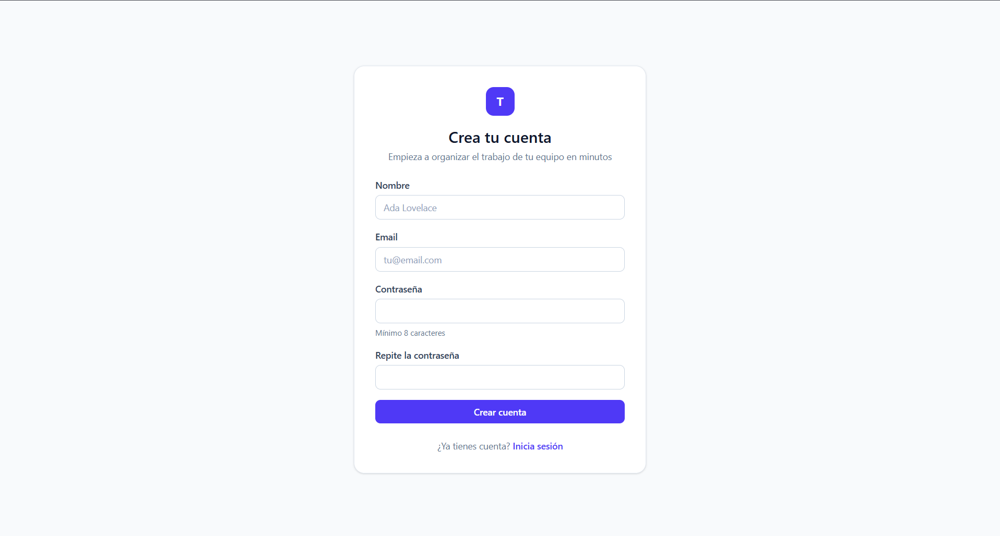
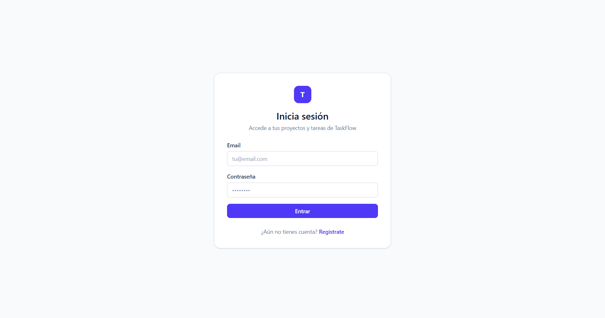
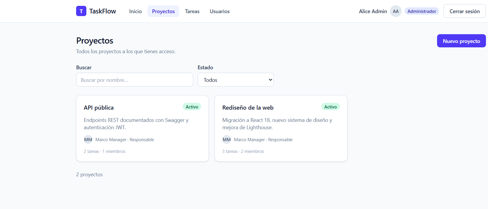
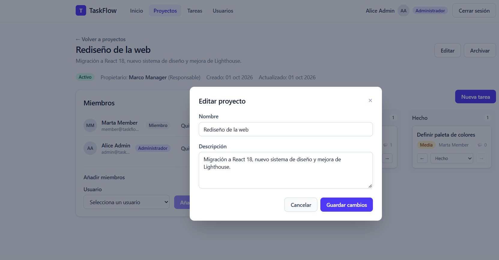
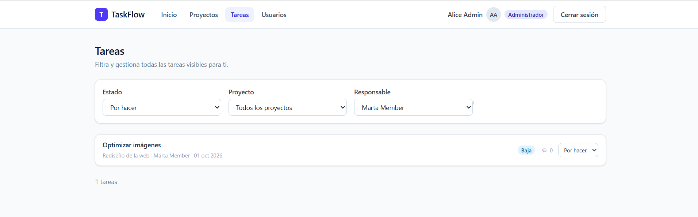
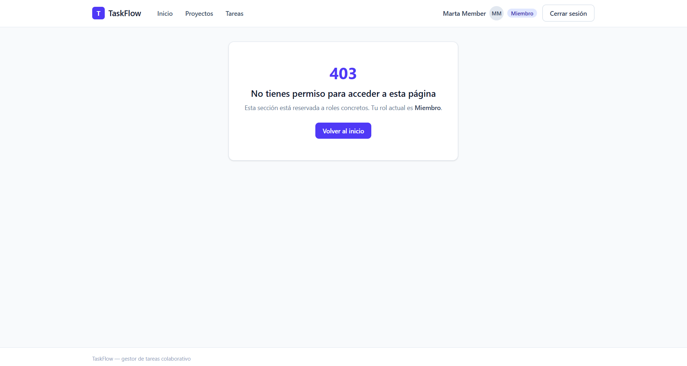

# TaskFlow — Guía de usuario 📘

Guía práctica para usar TaskFlow: cómo entrar, organizar proyectos, mover tareas por el tablero y
gestionar usuarios. Si eres desarrollador, consulta también [`DESARROLLADOR.md`](DESARROLLADOR.md).

---

## Índice

1. [Acceder a la aplicación](#1-acceder-a-la-aplicación)
2. [Registro y inicio de sesión](#2-registro-y-inicio-de-sesión)
3. [El panel (dashboard)](#3-el-panel-dashboard)
4. [Proyectos](#4-proyectos)
5. [El tablero Kanban](#5-el-tablero-kanban)
6. [Tareas y comentarios](#6-tareas-y-comentarios)
7. [Mis tareas](#7-mis-tareas)
8. [Administración de usuarios](#8-administración-de-usuarios)
9. [Qué puede hacer cada rol](#9-qué-puede-hacer-cada-rol)
10. [Preguntas frecuentes](#10-preguntas-frecuentes)

---

## 1. Acceder a la aplicación

Con la aplicación levantada (ver [README](../README.md)):

| Sitio                             | Dirección                      |
| --------------------------------- | ------------------------------ |
| Aplicación                        | http://localhost:5173          |
| Documentación de la API (Swagger) | http://localhost:4000/api/docs |

> Solo necesitas el navegador: la API y la base de datos ya están ejecutándose.


---

## 2. Registro y inicio de sesión

### Crear una cuenta

1. Abre http://localhost:5173 → te redirige a **`/login`**.
2. Pulsa **«Crear una cuenta»**.
3. Rellena:
   - **Nombre** (mínimo 2 caracteres)
   - **Email**
   - **Contraseña** (mínimo 8 caracteres) y su confirmación
4. Pulsa **Registrarse**. Las contraseñas se muestran en español si algo no cumple el mínimo.



> Las cuentas nuevas nacen con rol **`MEMBER`**. Un `ADMIN` puede cambiar tu rol después
> (apartado 8).

### Iniciar sesión

1. Introduce email y contraseña → **Iniciar sesión**.
2. Si todo es correcto, accedes al panel. Si no:

| Mensaje                  | Qué significa                                      |
| ------------------------ | -------------------------------------------------- |
| `Credenciales inválidas` | El email no existe o la contraseña no coincide.    |
| `Email no válido`        | Revisa el formato del email.                       |
| Error de red / `500`     | La API no está arrancada: comprueba `npm run dev`. |



### Tu sesión

- El **access token** dura **15 minutos** y se renueva **solo** cuando caduca: no verás avisos.
- El **refresh token** dura **7 días** y se rota en cada renovación; si caduca, volverás a
  iniciar sesión.
- Tu nombre y rol aparecen en el **menú de usuario** (esquina superior derecha).
- **Cerrar sesión** invalida tu refresh token en el servidor (no podrá reutilizarse).

### Cuentas de demostración

Si has ejecutado `npm run db:seed`:

| Email                  | Contraseña     | Rol           |
| ---------------------- | -------------- | ------------- |
| `admin@taskflow.dev`   | `Taskflow123!` | Administrador |
| `manager@taskflow.dev` | `Taskflow123!` | Gestor        |
| `member@taskflow.dev`  | `Taskflow123!` | Miembro       |

---

## 3. El panel (dashboard)

Es tu pantalla inicial (**`/`**).

| Zona                                       | Contenido                                                                                                            |
| ------------------------------------------ | -------------------------------------------------------------------------------------------------------------------- |
| **Mis tareas**                             | Totales y desglose por estado: pendientes (`TODO`), en curso (`IN_PROGRESS`) y terminadas (`DONE`).                  |
| **Lista «Mis tareas»**                     | Las 5 tareas asignadas a ti más recientes, con su proyecto y estado. Pulsa una para abrirla.                         |
| **Proyectos** _(solo `ADMIN` y `MANAGER`)_ | Cada proyecto activo con una **barra de progreso** (pendientes / en curso / terminadas), nº de miembros y de tareas. |


> Si eres `MEMBER` no verás la sección de proyectos: es normal, tus permisos alcanzan solo a los
> proyectos en los que participas.

---

## 4. Proyectos

Ruta: **`/projects`**.

### Listado

- Tarjeta por proyecto con **nombre, descripción, propietario, nº de miembros y nº de tareas**.
- **Buscador** (por nombre y descripción) y **filtro de estado** (`Activo` / `Archivado`).
- **Paginación** al pie.
- Cada tarjeta enlaza al detalle del proyecto.



### Crear un proyecto _(requiere rol `MANAGER` o `ADMIN`)_

1. Pulsa **«Nuevo proyecto»**.
2. Escribe el **nombre** (obligatorio) y una **descripción** (opcional).
3. **Guardar**. Aparecerás como propietario y podrás editar/borrarlo siempre.

Si eres `MEMBER` no verás el botón: intentarlo desde la API devuelve `403`.

### Detalle del proyecto (**`/projects/:id`**)

- **Cabecera**: nombre, descripción, estado (Activo/Archivado), propietario, miembros y tareas.
- **Acciones** (solo para quien puede gestionarlo):
  - **Editar** → cambiar nombre o descripción.
  - **Archivar / Restaurar** → los proyectos archivados siguen visibles pero se consideran
    terminados.
  - **Eliminar** → pide confirmación; borra también sus tareas y comentarios.


Al pulsar **Editar** se abre un modal con el nombre y la descripción:



### Miembros del proyecto

En el panel **«Miembros»** del detalle:

- **Añadir miembro**: selecciona un usuario y confirma.
  - Como `ADMIN` puedes buscar entre todos los usuarios.
  - Como `MANAGER` solo puedes añadir a usuarios de tu organización/roles disponibles; si la
    opción está deshabilitada, la API exige que seas `ADMIN`.
- **Quitar miembro**: icono de papelera junto al usuario.
- El **propietario** no aparece en la lista de miembros (ya tiene acceso por ser propietario).

> Reglas: solo el **propietario `MANAGER`** o un **`ADMIN`** gestionan miembros. Intentarlo con
> otro rol devuelve `403`.

---

## 5. El tablero Kanban

Dentro del detalle del proyecto encontrarás **tres columnas**:

```text
  ⬜ Pendientes        🟨 En curso         ✅ Terminadas
    (TODO)            (IN_PROGRESS)           (DONE)
```


### Mover una tarea

Tienes dos formas (sin arrastrar, funciona también en móvil):

- **Botones ← / →** en la tarjeta, o
- el **selector de estado** dentro de la tarjeta / del detalle de la tarea.

Quién puede mover cada tarea:

| Rol       | Condiciones                                            |
| --------- | ------------------------------------------------------ |
| `ADMIN`   | cualquier tarea de cualquier proyecto                  |
| `MANAGER` | solo tareas de los proyectos **que posee**             |
| `MEMBER`  | solo tareas **asignadas a él** y en las que es miembro |

### Información de la tarjeta

- **Título** y descripción (si existe).
- **Prioridad** con color: 🔴 Alta (`HIGH`) · 🟡 Media (`MEDIUM`) · ⚪ Baja (`LOW`).
- **Responsable** (avatar o nombre) o «Sin asignar».
- **Nº de comentarios** 💬.

### Crear tareas _(`MANAGER`/`ADMIN`)_

1. Pulsa **«Nueva tarea»** en la cabecera del tablero.
2. Rellena: **título** (obligatorio), **descripción**, **responsable** (solo miembros del
   proyecto), **prioridad** y **estado inicial** (por defecto `Pendiente`).
3. **Crear**.

---

## 6. Tareas y comentarios

### Listado general (**`/tasks`**)

- Combina tres **filtros**: estado, proyecto y responsable.
- Muestra paginación y el estado actual de cada tarea.
- Desde la propia fila puedes **cambiar el estado** si tienes permiso.


### Detalle de tarea (**`/tasks/:id`**)

| Sección         | Acciones                                                                                       |
| --------------- | ---------------------------------------------------------------------------------------------- |
| **Campos**      | Título, descripción, proyecto, prioridad, responsable, fechas de creación/actualización.       |
| **Estado**      | Selector `Pendiente → En curso → Terminado`.                                                   |
| **Editar**      | Título, descripción, prioridad y responsable (la reasignación es solo para `MANAGER`/`ADMIN`). |
| **Comentarios** | Hilo cronológico con autor y fecha; escribe el tuyo y pulsa **Comentar**.                      |
| **Eliminar**    | Solo `MANAGER` (propietario) o `ADMIN`.                                                        |

### Restricciones habituales

| Situación                                 | Resultado                                                 |
| ----------------------------------------- | --------------------------------------------------------- |
| Comentario vacío                          | `400` — «el comentario no puede estar vacío»              |
| Asignar a alguien que no es miembro       | `400` — «El responsable debe ser un miembro del proyecto» |
| `MEMBER` intenta cambiar una tarea ajena  | `403`                                                     |
| Tarea de un proyecto al que no perteneces | `404` (no se revela que exista)                           |

---

## 7. Mis tareas

La ruta **`/tasks`** con el filtro **responsable = yo** (o la lista del panel) muestra solo lo
asignado a ti. Consejos:

- Revisa primero la columna **En curso** desde el panel.
- Cambia el estado a **Terminada** al acabar: el progreso del proyecto se actualiza al instante.



---

## 8. Administración de usuarios

Ruta: **`/admin/users`** _(exclusiva de `ADMIN`)_.

- **Listado paginado** con buscador por nombre/email y filtro por rol.
- **Cambiar rol**: selector `ADMIN` / `MANAGER` / `MEMBER` + confirmación.
  - ⚠️ No se puede quitar el último `ADMIN` del sistema (aviso `403`).
- **Eliminar usuario**: con confirmación.
  - No puedes **eliminarte a ti mismo** (el botón aparece deshabilitado).
- Si intentas entrar sin ser `ADMIN`, verás una pantalla de **403 amigable**.




> Para editar tu propio nombre/email, usa tu perfil (la API permite `PATCH /users/:id` sobre tu
> propia cuenta).

---

## 9. Qué puede hacer cada rol

| Acción                          | `ADMIN` |                  `MANAGER`                   |    `MEMBER`    |
| :------------------------------ | :-----: | :------------------------------------------: | :------------: |
| Ver todos los proyectos         |   ✅    | ❌ (solo los suyos y los suyos como miembro) |       ❌       |
| Crear proyecto                  |   ✅    |                      ✅                      |       ❌       |
| Editar/archivar/borrar proyecto |   ✅    |              solo el que posee               |       ❌       |
| Añadir/quitar miembros          |   ✅    |             solo de su proyecto              |       ❌       |
| Crear/editar/borrar tareas      |   ✅    |             solo en su proyecto              |       ❌       |
| Cambiar estado de tareas        |   ✅    |             solo en su proyecto              | solo las suyas |
| Comentar                        |   ✅    |                      ✅                      |       ✅       |
| Ver progreso por proyecto       |   ✅    |                      ✅                      |       ❌       |
| Gestionar usuarios y roles      |   ✅    |                      ❌                      |       ❌       |

---

## 10. Preguntas frecuentes

**No veo el botón «Nuevo proyecto».**
Tu rol es `MEMBER`; solo `MANAGER` y `ADMIN` crean proyectos.

**He creado una tarea y no aparece en el tablero de un compañero.**
Cada persona ve las tareas según su rol: un `MEMBER` solo ve las asignadas a él.

**Me pide iniciar sesión otra vez.**
Tu refresh token (7 días) caducó o se cerró la sesión desde otro dispositivo.

**«No tienes permisos para…» (403).**
El rol actual no alcanza para esa acción. Comprueba tu rol en el menú de usuario; si deberías
tener más permisos, que un `ADMIN` te cambie el rol (la API usa el rol actualizado de la base de
datos).

**«Proyecto no encontrado» (404) en un proyecto que existe.**
No eres miembro ni propietario: TaskFlow no revela proyectos ajenos.

**Un proyecto archivado no se puede editar.**
Restáuralo desde la cabecera (si tienes permisos) y vuelve a editarlo.

**¿Dónde está la documentación técnica?**
Swagger en http://localhost:4000/api/docs y [`API.md`](API.md).

---

¿Falta algo? Añade la sección a este documento junto con el _pull request_ correspondiente.
